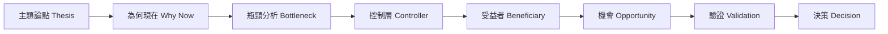
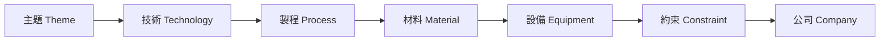
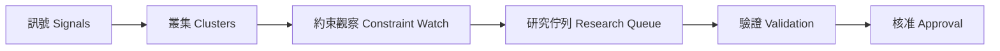

# Phase 12.11F Workflow Architecture Refactor Design

## Status

Proposed for approval. This specification changes frontend workflow composition and visualization only.

## Objective

Turn MIJI's Theme, Supply Chain, and Scout workspaces into three distinct research workflows:

- Theme answers: **Should I spend research time on this theme?**
- Supply Chain answers: **How does this industry actually work?**
- Scout answers: **What should research investigate next?**

The phase also fixes the Rotation treemap so its five states are visually distinguishable without reading numeric labels.

## Constraints

The implementation must not modify backend code, database schema, graph construction, lifecycle, Scout activation, proposal providers, ranking, scoring, Controller, Opportunity, Decision Packet, Phase 12.12, or Committee behavior.

All displayed entities, relationships, values, and availability states must come from existing persisted frontend contracts. Missing values remain unavailable. The frontend must not infer graph edges, industrial roles, beneficiaries, or research conclusions.

## Component Architecture

Create four independent components:

- `ThemeInvestmentWorkflow.tsx`
- `IndustrialDependencyWorkflow.tsx`
- `ScoutDiscoveryWorkflow.tsx`
- `IndustrialDependencyGraph.tsx`

Shared components may render labels, compact metrics, evidence references, unavailable states, lineage, and individual graph nodes. Shared components must not decide workflow order or primary content.

`ThemeResearchPage.tsx` remains the route-level data owner. It chooses the active Theme or Supply Chain workflow and passes the existing aggregate unchanged.

`ThemeScoutPage.tsx` remains the Scout fetch and candidate-selection owner. It delegates the selected snapshot and candidate to `ScoutDiscoveryWorkflow`.

## Theme Investment Workflow

### Workflow

### Data Admission

| Stage | Existing persisted source |
|---|---|
| Thesis | Aggregate identity, lifecycle, conviction, rank, time window |
| Why Now | `catalysts`, `discovery.brief`, persisted discovery evidence fields |
| Bottleneck | `bottlenecks`, canonical industrial constraints |
| Controller | `industrial_intelligence.controllers` |
| Beneficiary | Aggregate direct beneficiaries, resolution enablers, indirect beneficiaries |
| Opportunity | `industrial_intelligence.opportunities` |
| Validation | Coverage, research gaps, snapshot lineage |
| Decision | Decision Packet family and theme packet summaries |

Generated narrative fields, inferred graph explanations, and unstored resolution probabilities are not admitted.

### Composition

The Theme workspace is a vertical dossier with numbered workflow stages. It does not render the industrial dependency graph, industrial node columns, or the Supply Chain workspace. Validation and Decision are compact terminal sections after the primary research stages.

## Industrial Dependency Workflow

### Workflow

### Graph Projection

`IndustrialDependencyGraph` accepts the existing industrial graph contract and produces:

- one positioned node for every canonical node referenced by admitted graph edges or dependency paths;
- one directed SVG edge for every admitted persisted graph edge;
- edge labels copied from `relationship_type`;
- evidence count derived from each persisted edge's `evidence_ids`;
- deterministic ordering using the approved node-type order and canonical key sorting.

No edge is created from visual adjacency. Empty layers remain explicit but do not create placeholder nodes.

### Layout

The graph is the dominant viewport surface:

- SVG edge layer behind compact positioned nodes;
- horizontal type progression;
- visible arrow markers;
- distinct edge treatment for dependency, bottleneck, control, and resolution relationship families;
- bounded pan/scroll container rather than expanding page height.

Secondary inspection rails contain constraints, controller companies, dependency highlights, coverage, and evidence counts. Opportunity and Decision Packet surfaces do not appear as primary Supply Chain content.

## Scout Discovery Workflow

### Workflow

### Composition

- Snapshot ID, provider, evidence manifest checksum, and proposal checksum form a compact provenance strip.
- Candidate ranking becomes a narrow selector showing identity and lifecycle state.
- Signal Clusters and Constraint Watch are the first primary surface.
- Research Queue is the primary action surface.
- Evidence Distribution and Evidence-linked Companies are supporting evidence.
- Lifecycle is rendered as a pipeline from DISCOVERED through APPROVED or REJECTED.
- Confidence, coverage, readiness, and novelty remain compact metadata. Novelty stays unavailable when its availability state is unavailable.

The workspace contains no gauges, radar charts, candidate-health panels, recommendations, or automatic approval actions.

## Rotation P0 Visual Encoding

### Inputs

- Tile area: absolute persisted capital flow magnitude.
- State: deterministic projection of persisted rotation score, momentum, and flow direction.
- Fill intensity: persisted rotation score normalized within the assigned state range.
- Border and glow: momentum direction and magnitude.

### State Palette

| State | Fill family | Border behavior |
|---|---|---|
| Strong Leader | bright cyan-green | strong positive border and glow |
| Improving | teal/green-blue | positive left/upward accent |
| Neutral | dark graphite/slate | muted low-contrast border |
| Weakening | orange/amber | negative accent |
| Laggard | red/magenta-red | strong negative border and glow |

Neutral must not use yellow or olive as its dominant fill. Improving and Strong Leader must have different hue and intensity. Weakening and Laggard must have different hue and intensity.

Score changes shade only within the assigned state family; score cannot turn a neutral tile yellow.

## Chinese-First Terminology

Primary labels:

- 主題論點 / Thesis
- 為何現在 / Why Now
- 瓶頸分析 / Bottleneck
- 控制層 / Controller
- 受益者 / Beneficiary
- 機會 / Opportunity
- 驗證 / Validation
- 決策 / Decision
- 供應鏈情報 / Supply Chain Intelligence
- 工業依賴圖譜 / Industrial Dependency Graph
- 訊號 / Signals
- 訊號叢集 / Clusters
- 約束觀察 / Constraint Watch
- 研究佇列 / Research Queue
- 核准流程 / Approval

Chinese appears first and receives the stronger visual weight. English remains secondary.

## Testing Strategy

Tests must be written and observed failing before production changes.

Required contract coverage:

- Theme contains all eight workflow stages in order.
- Theme does not render the industrial dependency graph as primary content.
- Supply Chain contains the seven industrial layers and an SVG edge layer.
- Every rendered Supply Chain edge corresponds to an existing persisted edge.
- Scout orders Signals and Clusters before Constraint Watch and Research Queue.
- Scout candidate ranking is a selector, not the main surface.
- Primary compositions differ across all three workspaces.
- Rotation exposes five states and five distinct palette families.
- Neutral palette is dark graphite/slate, not yellow or olive.
- Momentum modifies border/glow independently of fill.
- Chinese-first labels are present.

## Browser Acceptance

Validate only at `http://localhost:3000`.

Validate Rotation, Theme, Supply Chain, and Scout at a desktop viewport. Theme and Supply Chain must be tested for HBM, CoWoS, Glass Substrate, CPO, AI Infrastructure, and Data Center Cooling.

Acceptance requires:

- no console errors;
- no false unavailable state when persisted intelligence exists;
- no inferred relationships;
- visually distinct workspace identities;
- five Rotation states distinguishable within two seconds;
- screenshots and viewport-density measurements captured after implementation.

